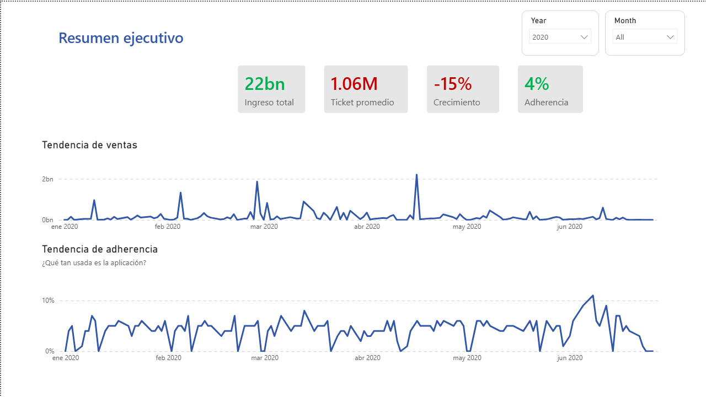
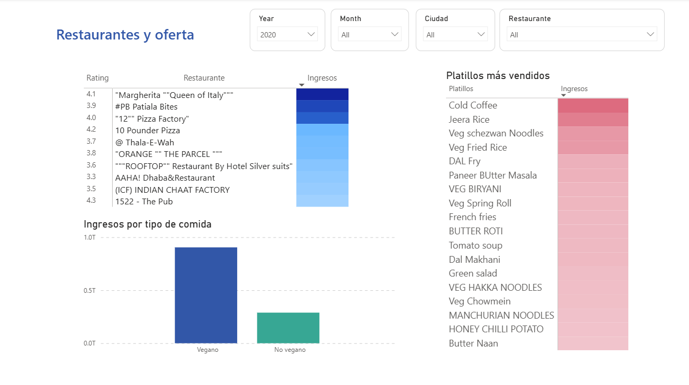
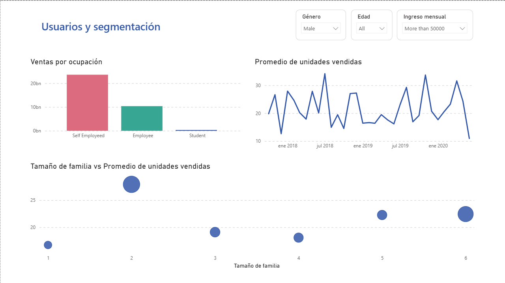
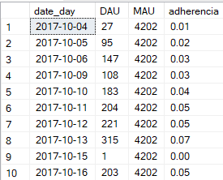
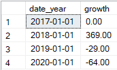

<h2>🍔 Descripción general:</h2>
 
En este ejercicio se realiza la exploración de datos en SQL Server y un dashboard de Power BI para descubrir tendencias en un dataset de la app de <b>comida a domicilio Zomato</b>, en la India. Las consultas realizadas incluyen top restaurantes y platillos, tamaño familiar vs promedio de pedidos, clientes por edad, ocupación e ingresos, ticket promedio, clientes registrados mensualmente, así como la adherencia de la aplicación y la tasa de crecimiento anual.</a>  
Conceptos clave:  </b>
  • <b>Adherencia</b>: Qué proporción de usuarios están activos en un día (DAU/MAU), un buen nivel de adherencia es considerado a partir del 20%: 
    • <b>DAU</b>: Daily Active Users, Usuarios activos por día. 
    • <b>MAU</b>: Monthly Active Users, Usuarios activos por mes.  
  • <b>Tasa de crecimiento</b>: Cuánto crecen las ventas respecto al mes o año anterior.  
  
 
<h2>⚙️Tecnologías: </h2>
 
    • SQL Server  
    • Microsoft Power BI 
  

<h2>🖇️ Fuente: </h2> 
https://www.kaggle.com/datasets/anas123siddiqui/zomato-database?select=restaurant.csv
 
 
 
<h2>📊 Actividades: </h2>
 
  • Definición de base de datos e importación de datos. 
  • Consultas para extraer ingresos y otras métricas. 
  • CTE y funciones de agregación.  
  • Visualización de resultados en Power BI.  
 
 
<h2><b></b>Exploración en Power BI</b></h2>
  
Cada una de las tarjetas indica en color verde (ganancias) o rojo (perdidas) el valor comparado con el mes anterior.  
 
La tendencia de ventas indica los ingresos, la tendencia de adherencia nos muestra qué tan usada ha sido la aplicación a través de los años.
  

   
En la siguiente pestaña se pueden realizar filtros para visualizar el top de restaurantes por rating e ingreso, así como los platillos más vendidos y los ingresos por tipo de comida. 
  

   
Al final de la presentación se muestra la segmentación de usuarios por ocupación, en adición, filtros por género, edad e ingreso mensual. Así mismo, el promedio de unidades vendidas en el tiempo y un diagrama de puntos en relación con el número de miembros por familia.
  

   
<h2><b></b>Exploración en SQL </b></h2> 
Algunas consultas de la exploración en SQL Server:
  
▫️Top 10 clientes por ingresos  

   
▫️Adherencia de la aplicación  

   

▫️Ingresos por tipo de cocina (vegana y no vegana)  

   
▫️Clientes registrados mensualmente  
Para este ejercicio, se consideró la primera compra de cada cliente como fecha de registro.  

   
▫️Top 10 platillos más vendidos  

   

▫️Tasa de crecimiento anual en ventas  

   

<h2>🔶 Observaciones generales:</h2>
 
• El restaurante con más ventas es MAHARAJA GRILLS & ROLLS, en Bangalore. 
• Los clientes que adquieren en promedio más platillos en la aplicación son personas que viven solas.  
• Las empleadas de 25 años que tienen un ingreso mensual superior a las 50,000 rupias y los estudiantes sin ingreso son los clientes que han generado más ventas. 
• Los restaurantes con mejor rating no siempre tienen las mejores ventas. 
• La cocina vegana es la más consumida. 
• El café frío en ambas variantes, vegano y no vegano es el más consumido.  
• El ticket promedio es de 1.29 millones de rupias. 
• La temporada con más registros de clientes ha sido de noviembre 2017 a enero 2018. 
• El promedio de adherencia mensual de la aplicación es alrededor de 5%, lo cual significa que los usuarios interactúan con ella de una a dos veces por mes. 
• La tasa de crecimiento es decreciente con los años.
 
